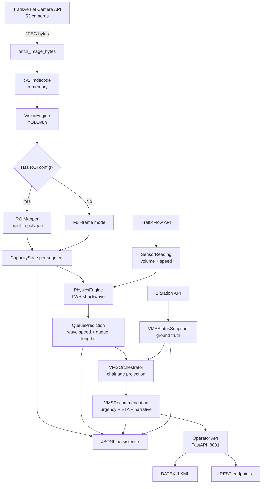

# Handoff Document — PTRE (Proactive Traffic Routing Engine)

> **Last updated:** 2026-02-16

---

## What Is This App?

PTRE is a **B2G traffic management copilot** built for Trafikverket / Trafik Stockholm. It monitors 53 live traffic cameras along the **E4 motorway (Södertälje → Stockholm)** and does something human operators cannot: it uses physics to **predict where a traffic queue will be in the future** and recommends preemptive VMS (Variable Message Sign) activations before the queue reaches upstream gantries.

### The Core Value Proposition

```
Human operators detect a crash → look at video → decide to activate VMS
Time: T₂

PTRE detects capacity drop via YOLO → computes shockwave math → predicts
queue tail will reach VMS-4003 in 6.5 min → recommends "KÖVARNING 70 km/h"
Time: T₁

Value = T₂ − T₁  (our speed advantage over human reaction)
```

The system does **not** compete with humans at *detecting* crashes (they have live video). It competes at *predicting queue propagation* — a math problem humans can't solve in real time.

---

## What Does It Produce?

Every 60 seconds, the system runs one **tick** that outputs:

| Output | Description |
|---|---|
| **CapacityState** per camera | Vehicle count, capacity (VPH), anomaly flags, confidence |
| **QueuePrediction** per bottleneck | Shockwave speed (km/h), queue length at T+1/3/5/10 min |
| **VMSRecommendation** per gantry | Which VMS sign to activate, ETA, urgency, Swedish narrative |
| **JSONL ground-truth log** | Every tick's data persisted to `data/{date}/sensor_data.jsonl` |
| **DATEX II XML** | European-standard export for the National Traffic System (NTS) |
| **Operator API** (FastAPI) | REST endpoints for a control room dashboard frontend |

---

## Architecture Overview

```
60s tick │ ThreadPoolExecutor (3 workers)
         ├── Camera API  → fetch_image_bytes() → cv2.imdecode() → YOLO → CapacityState[]
         ├── Sensor API  → TrafficFlow → SensorReading[] (upstream inflow + speed)
         └── Situation API → SPEEDMANAGEMENTID deviations → VMSStatusSnapshot[]
                │
                ▼
         Physics Engine (LWR kinematic wave model)
                │
                ▼
         QueuePrediction[] → VMS Orchestrator → VMSRecommendation[]
                │
                ▼
         ├── JSONL persistence (ground-truth log)
         ├── Operator API (FastAPI on :8081)
         └── DATEX II XML export
```

### The Tick Cycle (Stateless)

Each tick evaluates the world **from scratch** — no cross-tick memory, no temporal state. This is by design: the cameras deliver one static JPEG per 60 seconds, not video.

The tick is orchestrated by `tick_once()` in `main_loop.py`:

1. **Fetch** — Three concurrent API calls via ThreadPoolExecutor:
   - Camera images (fetched into RAM, never written to disk)
   - TrafficFlow sensor data (upstream volume + speed)
   - Situation API VMS proxy (ground-truth of human operator actions)
2. **Perceive** (Vision Engine) — Run YOLOv8n on each frame, classify detections into ROI polygons, output `CapacityState`
3. **Predict** (Physics Engine) — Identify bottlenecks, compute LWR shockwave speed, project queue tail at T+1/3/5/10 min
4. **Recommend** (VMS Orchestrator) — Map predicted queue tail to physical VMS gantry positions, generate activation recommendations
5. **Persist** — Write JSONL, update dashboard state, log results

---

## Component-by-Component Logic

### 1. Data Ingestion (`main_loop.py`, `config.py`)

- **Camera API:** Fetches 53 cameras from the Trafikverket Camera API. Images are decoded in RAM (`cv2.imdecode(np.frombuffer(...))`), processed, and immediately discarded. No disk write unless the retention policy triggers.
- **Sensor API:** Polls `TrafficFlow` for upstream radar/loop-detector data (vehicles per hour + average speed). Aggregated into a single mean `SensorReading` per tick.
- **Situation API (VMS proxy):** Polls `Situation.Deviation` records filtered by `MessageCode = 'Hastighetsbegränsning gäller'` and `SPEEDMANAGEMENTID` IDs. This is the **closest available proxy** for when a human operator activates a VMS sign. In production, this would be replaced by a direct TMC feed.
- **Camera exclusion:** Cameras can be excluded via `data/excluded_cameras.json`. The main loop re-reads this file every tick (no restart needed).
- **Camera chainage:** Camera positions are mapped to a linear chainage (km along the E4 corridor) by sorting latitudes south→north and interpolating over the 15.8 km corridor. This feeds the physics engine.

### 2. Vision Engine (`src/vision_engine.py`)

The perception module that converts a camera frame into a capacity estimate:

- **YOLOv8n inference** — Filters for COCO vehicle classes: car (2), motorcycle (3), bus (5), truck (7). Confidence threshold: 0.25.
- **ROI filtering** — If the camera has ROI polygons (`camera_config.json`), detections are classified into road segments using Shapely point-in-polygon tests on the tire-contact point (`x=(x1+x2)/2`, `y=y2`). Detections outside all ROIs are discarded.
- **Capacity estimation** — Simplified Greenshields model: `density × speed`, capped at theoretical lane maximum. Falls back to lane-based free-flow estimate when no upstream sensor.
- **Anomaly detection:**
  - Abnormal bounding box aspect ratios (sideways vehicles)
  - Zero detections + high inflow (camera blocked but traffic flowing)
  - Speed drop + low detection count (possible accident)
- **Sensor fusion fallback** — Black/broken image + speed drop >50% → `capacity = 0`, `is_anomaly = True`
- **Multi-ROI mode** (`analyze_multi_roi()`) — Runs YOLO once on the full frame, classifies detections per-segment, returns `MultiSegmentCapacity` with per-road `RoadSegmentState`

### 3. ROI Mapper (`src/roi_mapper.py`)

Maps 2D pixel coordinates to physical road segments:

- Polygons defined in `camera_config.json` — each ROI has: `road_id`, `direction_relative_to_camera`, `capacity_vph`, `num_lanes`, `polygon` (pixel coordinates)
- Uses **Shapely** `Point.within(Polygon)` for classification
- `classify_detections_batch()` groups detections by road segment
- Cameras without ROI config fall back to full-frame single-mode (backward compatible)
- ROIs are drawn interactively using `roi_helper.py` (OpenCV-based polygon drawing tool that fetches live camera images)

### 4. Physics Engine (`src/physics_engine.py`)

Stateless LWR (Lighthill–Whitham–Richards) shockwave calculator:

**When does it trigger?** When a camera's `estimated_capacity_vph` drops below the upstream `inflow_volume_vph` by at least 200 VPH — this indicates a bottleneck.

**The core formula:**

```
Wave_Speed = (Q_in − Q_cap) / (k_jam − k_in)

Where:
  Q_in  = upstream inflow volume (veh/h/lane)
  Q_cap = bottleneck capacity (veh/h/lane)
  k_jam = jam density = 133 veh/km/lane (Swedish Transport Admin default)
  k_in  = Q_in / v_in (per lane)
```

**Output:** `QueuePrediction` — shockwave speed (km/h), queue lengths at T+1, T+3, T+5, T+10 minutes, origin chainage (km along corridor), and origin GPS coordinates.

A positive wave speed means the queue tail is growing upstream (toward oncoming traffic).

### 5. VMS Orchestrator (`src/vms_orchestrator.py`)

Predicts when the queue tail will reach upstream VMS gantries:

- **8 VMS gantries** defined in `vms_config.json` along the E4 (Hallunda to Kristineberg, 0.5–15.8 km chainage)
- For each `QueuePrediction`, at each time horizon (T+1, T+3, T+5 min):
  1. Compute predicted queue tail chainage: `origin_chainage − (speed × time)`
  2. Find the nearest VMS gantry that is ≥1.0 km upstream of the queue tail
  3. Compute ETA to that gantry
  4. Classify urgency: `< 2 min = CRITICAL`, `< 5 min = HIGH`, `< 10 min = MEDIUM`, else `LOW`
  5. Generate Swedish display message: `"KÖVARNING 70 km/h"` or `"KÖ — SÄNK FARTEN"` for critical
  6. Generate operator narrative (Swedish) explaining the physics

**Ground-truth enrichment:** Each recommendation includes a `proxy_ground_truth_active` flag from the Situation API polling — so you can compare when the AI recommended activation vs. when the human operator actually acted.

### 6. Operator API (`src/operator_api.py`)

FastAPI service (port 8081) providing decision support endpoints:

| Endpoint | What it returns |
|---|---|
| `GET /api/v1/operator/active-incidents` | AI-verified incidents with YOLO thumbnails and capacity drop % |
| `GET /api/v1/operator/vms-recommendations` | VMS recommendations + `proxy_ground_truth_active` flag |
| `GET /api/v1/export/datex2` | DATEX II XML (`SituationPublication` + `SpeedManagement` records) |
| `GET /health` | Service health with pipeline metadata |

State is injected by `main_loop.py` each tick via setter functions (`set_active_incidents()`, `set_active_predictions()`, etc.). The API is **read-only** — it doesn't modify anything.

### 7. Smart Retention (`retention.py`)

Instead of saving 76,000 images/day (~860 MB), only saves:

1. **Anomalies** → `storage/anomalies/{date}/{cam}_{time}.jpg` (for debugging false positives)
2. **Training samples** → `storage/training/{date}/{cam}_{time}.jpg` (1 frame/camera every 4 hours, randomized offsets)

**Result:** ~860 MB/day → ~5 MB/day.

### 8. Dashboard (`dashboard.py` + `static/`)

FastAPI server on port 8080 with:

- Interactive Leaflet map with 53 camera markers and photo popups
- Camera image grid, weather table, road conditions, incident table
- Live scrollable logs with error highlighting
- Camera exclude/restore management via API
- Status bar: tick count, last update, disk usage, active incidents

---

## Key Files

| File | Lines | Purpose |
|---|---|---|
| `main_loop.py` | 843 | **Tick-based orchestrator** — the heart of the system |
| `src/vision_engine.py` | 545 | YOLOv8n perception + capacity estimation |
| `src/physics_engine.py` | 240 | LWR shockwave model |
| `src/vms_orchestrator.py` | 307 | Queue tail → VMS gantry ETA prediction |
| `src/operator_api.py` | 492 | FastAPI operator endpoints + DATEX II export |
| `src/models.py` | 263 | Pydantic domain models |
| `src/roi_mapper.py` | 170 | Pixel → road segment classification |
| `config.py` | 200 | Camera IDs, coordinates, API config |
| `collect.py` | 800+ | Legacy standalone collector (retained for data capture) |
| `dashboard.py` | 300 | FastAPI dashboard server |
| `retention.py` | 130 | Smart image retention policy |
| `roi_helper.py` | 389 | Interactive OpenCV ROI calibration tool |
| `discover_cameras.py` | 100 | Camera discovery from Trafikverket API |
| `camera_config.json` | — | Per-camera ROI polygon definitions |
| `vms_config.json` | 77 | VMS gantry positions (8 gantries, 0.5–15.8 km) |

---

## Data Flow Diagram



---

## How to Run

```bash
# Setup
python3 -m venv .venv && source .venv/bin/activate
pip install -r requirements.txt
cp .env.example .env   # Add TRAFIKVERKET_API_KEY

# Single tick (test)
python main_loop.py --once

# Continuous monitoring
python main_loop.py

# Operator API
python -m src.operator_api   # → http://localhost:8081

# Dashboard
python dashboard.py          # → http://localhost:8080

# Docker
docker compose up -d

# Tests (92 passing)
python -m pytest tests/ -v --ignore=tests/smoke_test.py
```

---

## Test Suite — 92 Tests

| Suite | Count | What it covers |
|---|---|---|
| Physics Engine | 13 | LWR formula, edge cases, zero inputs, multi-bottleneck |
| Vision Engine | 16 | Models, black images, capacity estimation, anomalies |
| ROI Mapper | 16 | Polygon loading, point-in-polygon, batch classification |
| VMS Orchestrator | 18 | Queue tail projection, gantry matching, urgency, narratives |
| Operator API | 21 | Endpoints, DATEX II XML, ground-truth matching, health |

---

## Known Limitations

1. **No live VMS panel state** — public API only exposes speed advisories, not physical sign hardware state
2. **VMS proxy is approximate** — `SPEEDMANAGEMENTID` deviations are roadwork-related speed limits, not real-time VMS activations
3. **YOLO model untrained** — using default YOLOv8n weights, no fine-tuning on Swedish cameras (night, winter, sun glare)
4. **Single corridor** — hardcoded to E4 Södertälje→Stockholm, needs generalization

---

## What's Left to Do

- [ ] Wire `main_loop.py` tick output into `operator_api.py` state setters (live integration)
- [ ] Deploy on VPS with Docker Compose
- [ ] Fine-tune YOLO on Swedish camera images
- [ ] Build control room dashboard frontend consuming the Operator API
- [ ] Formal DATEX II XSD validation against Trafikverket NTS schemas
