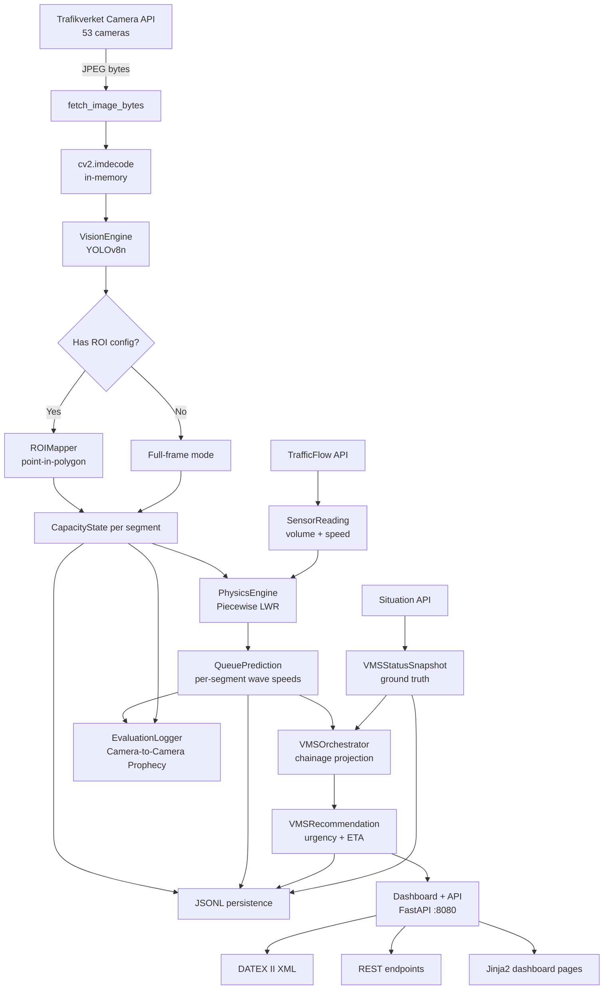

# Handoff Document — PTRE (Proactive Traffic Routing Engine)

> **Last updated:** 2026-02-18

---

## What Is This App?

PTRE is a **B2G traffic management copilot** built for Trafikverket / Trafik Stockholm. It monitors 53 live traffic cameras along the **E4 motorway (Södertälje → Stockholm)** and does something human operators cannot: it uses physics to **predict where a traffic queue will be in the future** and recommends preemptive VMS (Variable Message Sign) activations before the queue reaches upstream gantries.

### The Core Value Proposition

```
Human operators detect a crash → look at video → decide to activate VMS
Time: T₂

PTRE detects capacity drop via YOLO → computes shockwave math → predicts
queue tail will reach VMS-4003 in 6.5 min → recommends "KÖVARNING 70 km/h"
Time: T₁

Value = T₂ − T₁  (our speed advantage over human reaction)
```

The system does **not** compete with humans at *detecting* crashes (they have live video). It competes at *predicting queue propagation* — a math problem humans can't solve in real time.

---

## What Does It Produce?

Every 60 seconds, the system runs one **tick** that outputs:

| Output | Description |
|---|---|
| **CapacityState** per camera | Vehicle count, capacity (VPH), anomaly flags, confidence |
| **QueuePrediction** per bottleneck | Piecewise shockwave speeds, queue length at T+1/3/5/10 min |
| **VMSRecommendation** per gantry | Which VMS sign to activate, ETA, urgency, Swedish narrative |
| **Prophecy** per upstream camera | Cross-validation: "queue will reach camera X in N min" |
| **JSONL ground-truth log** | Every tick's data persisted to `data/{date}/sensor_data.jsonl` |
| **DATEX II XML** | European-standard export for the National Traffic System (NTS) |
| **Dashboard** (FastAPI :8080) | Multi-page control-room UI with Jinja2 templates |

---

## Architecture Overview

```
60s tick │ ThreadPoolExecutor (3 workers)
         ├── Camera API  → fetch_image_bytes() → cv2.imdecode() → YOLO → CapacityState[]
         ├── Sensor API  → TrafficFlow → SensorReading[] (upstream inflow + speed)
         └── Situation API → SPEEDMANAGEMENTID deviations → VMSStatusSnapshot[]
                │
                ▼
         Vision Engine (YOLOv8n → ROI → density → capacity)
                │
                ▼
         Physics Engine (Piecewise LWR with multi-segment spatial iteration)
                │
                ▼
         QueuePrediction[] → VMS Orchestrator → VMSRecommendation[]
                │
                ├── Evaluation Logger → Prophecy[] (camera-to-camera cross-validation)
                ├── JSONL persistence (ground-truth log)
                ├── Operator API + Dashboard (FastAPI on :8080)
                └── DATEX II XML export
```

### The Tick Cycle (Stateless)

Each tick evaluates the world **from scratch** — no cross-tick memory, no temporal state. This is by design: the cameras deliver one static JPEG per 60 seconds, not video.

The tick is orchestrated by `tick_once()` in `main_loop.py` and driven by `_tick_loop_background()` in `main.py`:

1. **Fetch** — Three concurrent API calls via ThreadPoolExecutor:
   - Camera images (fetched into RAM, never written to disk)
   - TrafficFlow sensor data (upstream volume + speed)
   - Situation API VMS proxy (ground-truth of human operator actions)
2. **Perceive** (Vision Engine) — Run YOLOv8n on each frame, classify detections into ROI polygons, output `CapacityState`
3. **Predict** (Physics Engine) — Identify bottlenecks, compute piecewise LWR shockwave, project queue tail at T+1/3/5/10 min
4. **Recommend** (VMS Orchestrator) — Map predicted queue tail to physical VMS gantry positions, generate activation recommendations
5. **Cross-validate** (Evaluation Logger) — Create prophecies predicting when the queue will reach the next upstream camera; evaluate past prophecies
6. **Persist** — Write JSONL, update dashboard state, log results

---

## Component-by-Component Logic

### 1. Data Ingestion (`main_loop.py`, `config.py`)

- **Camera API:** Fetches 53 cameras from the Trafikverket Camera API. Images are decoded in RAM (`cv2.imdecode(np.frombuffer(...))`), processed, and immediately discarded. No disk write unless the retention policy triggers.
- **Sensor API:** Polls `TrafficFlow` for upstream radar/loop-detector data (vehicles per hour + average speed). Aggregated into a single mean `SensorReading` per tick.
- **Situation API (VMS proxy):** Polls `Situation.Deviation` records filtered by `MessageCode = 'Hastighetsbegränsning gäller'` and `SPEEDMANAGEMENTID` IDs. This is the **closest available proxy** for when a human operator activates a VMS sign. In production, this would be replaced by a direct TMC feed.
- **Camera exclusion:** Cameras can be excluded via `data/excluded_cameras.json`. The main loop re-reads this file every tick (no restart needed).
- **Camera chainage:** Camera positions are mapped to a linear chainage (km along the E4 corridor) by sorting latitudes south→north and interpolating over the 15.8 km corridor. This feeds the physics engine.

### 2. Vision Engine (`src/vision_engine.py`)

The perception module that converts a camera frame into a capacity estimate:

- **YOLOv8n inference** — Filters for COCO vehicle classes: car (2), motorcycle (3), bus (5), truck (7). Confidence threshold: 0.25.
- **ROI filtering** — If the camera has ROI polygons (`camera_config.json`), detections are classified into road segments using Shapely point-in-polygon tests on the tire-contact point (`x=(x1+x2)/2`, `y=y2`). Detections outside all ROIs are discarded.
- **Density estimation** — Simplified Greenshields model:
  ```
  density = vehicle_count / roi_length_km
  capacity = density × speed_kmh
  ```
  The `roi_length_km` is taken from each ROI's calibrated `roi_length_meters` field (see §3 below).

- **Jam density safety clamp** — Density is capped at `JAM_DENSITY × num_lanes` (133 veh/km/lane × lanes). This prevents YOLO hallucinations (e.g., double-counting in snow/rain) from producing unrealistically high densities that would cause absurd shockwave speeds. When triggered, the clamp logs a warning.
  ```
  max_density = 133 × num_lanes
  density     = min(density, max_density)
  ```

- **Capacity cap** — Final capacity is capped at `2200 × num_lanes` VPH (free-flow theoretical max per lane).

- **Anomaly detection:**
  - Abnormal bounding box aspect ratios (sideways vehicles)
  - Zero detections + high inflow (camera blocked but traffic flowing)
  - Speed drop + low detection count (possible accident)
- **Sensor fusion fallback** — Black/broken image + speed drop >50% → `capacity = 0`, `is_anomaly = True`
- **Multi-ROI mode** (`analyze_multi_roi()`) — Runs YOLO once on the full frame, classifies detections per-segment, returns `MultiSegmentCapacity` with per-road `RoadSegmentState`

### 3. ROI Mapper & Spatial Calibration (`src/roi_mapper.py`, `roi_helper.py`)

Maps 2D pixel coordinates to physical road segments:

- Polygons defined in `camera_config.json` — each ROI has: `road_id`, `direction_relative_to_camera`, `capacity_vph`, `num_lanes`, `roi_length_meters`, `polygon` (pixel coordinates)
- Uses **Shapely** `Point.within(Polygon)` for classification
- `classify_detections_batch()` groups detections by road segment
- Cameras without ROI config fall back to full-frame single-mode (backward compatible)

**Spatial calibration (Perspective Ruler):**

ROIs must know their physical road length (in meters) to convert vehicle counts into density. Since camera perspective is non-linear (pixels near the horizon represent more physical distance), we use **empirical 1D polynomial perspective calibration**:

1. User draws ROI polygons interactively with `roi_helper.py`
2. Presses **W** → enters Perspective Ruler mode
3. Clicks the **start of consecutive dashed road markings** from bottom to top (min 4 clicks)
4. Each click is exactly **12 m** apart (Swedish dashed centre line: 3 m dash + 9 m gap)
5. System fits a **2nd-degree polynomial** `Y-pixel → physical meters`:
   ```python
   z_coeffs = np.polyfit(y_pixels, d_meters, 2)  # quadratic fit
   p = np.poly1d(z_coeffs)
   ```
6. For each ROI polygon, calculates physical length from its Y-bounds:
   ```python
   roi_length_meters = abs(p(y_top) - p(y_bottom))
   ```
7. Saves `roi_length_meters` to `camera_config.json` per ROI

Legacy configurations without `roi_length_meters` default to 100 m and log a warning prompting recalibration.

### 4. Physics Engine (`src/physics_engine.py`)

**Piecewise LWR (Lighthill–Whitham–Richards) shockwave calculator** with multi-segment spatial iteration.

Unlike a simple single-point model, this engine walks **backward through camera nodes** from the bottleneck, computing a separate wave speed per inter-camera segment using the local inflow at each node.

#### When Does It Trigger?

When a camera's `estimated_capacity_vph` drops below the upstream `inflow_volume_vph` by at least **200 VPH** (`MIN_CAPACITY_DROP_VPH`). This indicates a bottleneck. Only cameras flagged `is_anomaly = True` by the vision engine are evaluated.

#### The Core LWR Formula

```
w = (Q_in − Q_cap) / (k_jam − k_in)

Where:
  Q_in  = upstream inflow volume (veh/h/lane)
  Q_cap = bottleneck capacity (veh/h/lane)
  k_jam = jam density = 133 veh/km/lane (Swedish Transport Admin default)
  k_in  = Q_in / v_in (inflow density per lane)
```

A positive `w` means the queue tail is growing **upstream** (toward oncoming traffic).

#### Piecewise Spatial Iteration

Instead of assuming a uniform wave speed, the engine walks backward through camera nodes, computing per-segment wave speeds:

```
Bottleneck (camera N)
     │
     ▼  Segment N → N-1: compute w using local inflow at node N-1
     │
     ▼  Segment N-1 → N-2: compute w using local inflow at node N-2
     │
     ▼  ... (continues until wave speed ≤ 0 or no more upstream nodes)

Each segment produces a SegmentSpeed:
  - distance_km: physical distance between adjacent cameras
  - wave_speed_kmh: LWR speed for this segment
  - local_inflow_vph: measured inflow at the upstream end
```

#### Queue Length Computation

The `_compute_lengths_piecewise()` method accumulates transit time through segments:

For each time horizon T (1, 3, 5, 10 minutes):
1. Walk through segments, summing `segment_distance / wave_speed` per segment
2. When cumulative time reaches T, interpolate within the current segment
3. If T exceeds all known segments, **extrapolate** using the last segment's wave speed

This produces `lengths_at_minutes: dict[int, float]` — predicted queue length in km at each future time horizon.

#### Edge Cases & Safety

| Condition | Behavior |
|---|---|
| Inflow density ≥ jam density | Caps wave speed at `free_flow_speed × 0.5` |
| Wave speed ≤ 0 | Iteration halts (queue stops growing) |
| No sensor data available | Skips physics computation entirely |
| Single camera (no chainage) | Falls back to legacy single-point model |
| Capacity drop < 200 VPH | Not considered a bottleneck |

#### Physical Constants

| Constant | Value | Source |
|---|---|---|
| `JAM_DENSITY_VEH_KM_LANE` | 133 veh/km/lane | Swedish Transport Admin default |
| `FREE_FLOW_SPEED_KMH` | 110 km/h | E4 motorway speed limit |
| `FREE_FLOW_VPH_PER_LANE` | 2200 veh/h/lane | Highway capacity manual |
| `DEFAULT_TIME_HORIZONS` | [1, 3, 5, 10] minutes | Prediction windows |
| `MIN_CAPACITY_DROP_VPH` | 200 veh/h | Bottleneck detection threshold |

### 5. VMS Orchestrator (`src/vms_orchestrator.py`)

Predicts when the queue tail will reach upstream VMS gantries:

- **8 VMS gantries** defined in `vms_config.json` along the E4 (Hallunda to Kristineberg, 0.5–15.8 km chainage)
- For each `QueuePrediction`, at each time horizon (T+1, T+3, T+5 min):
  1. Compute predicted queue tail chainage: `origin_chainage − (speed × time)`
  2. Find the nearest VMS gantry that is ≥1.0 km upstream of the queue tail
  3. Compute ETA to that gantry
  4. Classify urgency: `< 2 min = CRITICAL`, `< 5 min = HIGH`, `< 10 min = MEDIUM`, else `LOW`
  5. Generate Swedish display message: `"KÖVARNING 70 km/h"` or `"KÖ — SÄNK FARTEN"` for critical
  6. Generate operator narrative (Swedish) explaining the physics

**Ground-truth enrichment:** Each recommendation includes a `proxy_ground_truth_active` flag from the Situation API polling — so you can compare when the AI recommended activation vs. when the human operator actually acted.

### 6. Evaluation Logger (`src/evaluation_logger.py`)

**Camera-to-Camera Prophecy** — the self-validation layer:

For each `QueuePrediction`, the logger:
1. Finds the nearest **upstream camera** (lower chainage on northbound E4)
2. Computes **ETA** to that camera using the prediction's shockwave speed
3. Creates a `Prophecy`: "Queue from camera X will reach camera Y at time T"

On each subsequent tick, pending prophecies are evaluated:
- **VERIFIED_SUCCESS** — The target camera reports `is_anomaly = True` or capacity below free-flow threshold within ±90s of predicted impact time
- **FAILED** — Target camera is healthy at impact time
- **EXPIRED** — No data received within the tolerance window

Statistics tracked: total prophecies, verified hits, failures, hit rate. Persisted to JSONL for offline analysis.

### 7. Incident Builder (`src/incident_builder.py`)

Converts raw `CapacityState` anomalies into structured `IncidentReport` objects with GPS coordinates, capacity drop percentage, and severity classification. Fed into the Operator API for the dashboard.

### 8. Operator API & Dashboard (`main.py`, `src/operator_api.py`)

Unified FastAPI application (port 8080) serving both the API and dashboard:

| Endpoint | What it returns |
|---|---|
| `GET /api/v1/operator/active-incidents` | AI-verified incidents with YOLO thumbnails and capacity drop % |
| `GET /api/v1/operator/vms-recommendations` | VMS recommendations + `proxy_ground_truth_active` flag |
| `GET /api/v1/export/datex2` | DATEX II XML (`SituationPublication` + `SpeedManagement` records) |
| `GET /api/v1/evaluation/stats` | Prophecy accuracy statistics (hit rate, pending count) |
| `GET /api/v1/evaluation/log` | Prophecy event log |
| `GET /api/v1/cameras` | Per-camera status from latest tick |
| `GET /api/v1/sensors` | Latest sensor readings |
| `GET /api/v1/camera-config` | ROI polygon config from `camera_config.json` |
| `GET /api/v1/camera-image/{id}` | Proxied live camera image |
| `GET /api/v1/anomalies` | Anomaly event log with annotated images |
| `GET /health` | Service health with pipeline metadata |
| `GET /`, `/cameras`, `/sensors`, `/logs`, `/system`, `/anomalies` | Dashboard pages (Jinja2 templates) |

State is injected by `_tick_loop_background()` each tick via setter functions. The API is **read-only**.

### 9. Smart Retention (`retention.py`)

Instead of saving 76,000 images/day (~860 MB), only saves:

1. **Anomalies** → `storage/anomalies/{date}/{cam}_{time}.jpg` (for debugging false positives)
2. **Training samples** → `storage/training/{date}/{cam}_{time}.jpg` (1 frame/camera every 4 hours, randomized offsets)

**Result:** ~860 MB/day → ~5 MB/day.

---

## Data Model Summary (`src/models.py`)

```
SensorReading
  ├── inflow_volume_vph    # Upstream traffic volume
  └── average_speed_kmh    # Upstream mean speed

CameraMetadata
  ├── camera_id, name, lat, lng
  ├── num_lanes (default 2)
  └── road (default "E4")

CapacityState                          # Vision Engine output
  ├── vehicle_count, estimated_capacity_vph
  ├── total_lanes, upstream_speed_kmh
  ├── is_anomaly, anomaly_reason
  └── confidence

RoadSegmentState                       # Per-ROI output
  ├── road_id, direction, vehicle_count
  ├── estimated_capacity_vph, num_lanes
  └── is_anomaly, anomaly_reason

MultiSegmentCapacity                   # Multi-ROI wrapper
  ├── segments: list[RoadSegmentState]
  └── unmatched_detections

SegmentSpeed                           # Per-segment wave speed
  ├── distance_km, wave_speed_kmh
  └── local_inflow_vph

QueuePrediction                        # Physics Engine output
  ├── camera_id, bottleneck_capacity_vph
  ├── origin_chainage_km, origin_lat/lng
  ├── growth_speed_kmh                 # Weighted-average wave speed
  ├── segments: list[SegmentSpeed]     # Per-segment breakdown
  └── lengths_at_minutes: {1: km, 3: km, 5: km, 10: km}

VMSRecommendation                      # VMS Orchestrator output
  ├── vms_id, vms_name
  ├── eta_minutes, urgency
  ├── message, speed_limit
  └── proxy_ground_truth_active

Prophecy                               # Evaluation Logger
  ├── source_camera_id → target_camera_id
  ├── predicted_impact_time
  └── status: pending | VERIFIED_SUCCESS | FAILED | EXPIRED
```

---

## Key Files

| File | Lines | Purpose |
|---|---|---|
| `main.py` | 604 | **Unified entry point** — FastAPI + tick loop + dashboard |
| `main_loop.py` | 1053 | **Tick-based orchestrator** — fetch/perceive/predict/persist |
| `src/vision_engine.py` | 569 | YOLOv8n perception + density estimation + anomaly detection |
| `src/physics_engine.py` | 425 | Piecewise LWR shockwave model |
| `src/vms_orchestrator.py` | 313 | Queue tail → VMS gantry ETA prediction |
| `src/operator_api.py` | 549 | FastAPI operator endpoints + DATEX II export |
| `src/evaluation_logger.py` | 370 | Camera-to-Camera Prophecy validation |
| `src/incident_builder.py` | 54 | CapacityState → IncidentReport conversion |
| `src/models.py` | 292 | Pydantic domain models |
| `src/roi_mapper.py` | 208 | Pixel → road segment classification |
| `config.py` | 221 | Camera IDs, coordinates, API config |
| `roi_helper.py` | 970 | Interactive ROI calibration + perspective ruler |
| `dashboard.py` | 358 | Legacy standalone dashboard (now merged into `main.py`) |
| `retention.py` | 142 | Smart image retention policy |
| `camera_config.json` | — | Per-camera ROI polygon definitions |
| `vms_config.json` | 77 | VMS gantry positions (8 gantries, 0.5–15.8 km) |

---

## Data Flow Diagram



---

## How to Run

```bash
# Setup
python3 -m venv .venv && source .venv/bin/activate
pip install -r requirements.txt
cp .env.example .env   # Add TRAFIKVERKET_API_KEY

# Unified server (API + dashboard + tick loop)
python main.py                      # → http://localhost:8080

# Single tick (test)
python main.py --once

# ROI calibration tool
python roi_helper.py --camera 9001  # → Interactive OpenCV window

# Tests (115 passing)
python -m pytest tests/ -v
```

---

## Test Suite — 115 Tests

| Suite | Count | What it covers |
|---|---|---|
| Physics Engine | 15 | LWR formula, piecewise iteration, edge cases, custom jam density |
| Vision Engine | 10 | Models, black images, capacity estimation, is_black |
| ROI Mapper | 11 | Polygon loading, point-in-polygon, batch, Shapely property |
| VMS Orchestrator | 15 | Queue tail projection, gantry matching, urgency, Swedish messages |
| Operator API | 14 | Endpoints, DATEX II XML, ground-truth matching, health |
| Evaluation Logger | 12 | Prophecy creation, evaluation, persistence, hit rate |
| Incident Builder | 2 | Incident report generation, defaults |

---

## Known Limitations

1. **No live VMS panel state** — public API only exposes speed advisories, not physical sign hardware state
2. **VMS proxy is approximate** — `SPEEDMANAGEMENTID` deviations are roadwork-related speed limits, not real-time VMS activations
3. **YOLO model untrained** — using default YOLOv8n weights, no fine-tuning on Swedish cameras (night, winter, sun glare)
4. **Single corridor** — hardcoded to E4 Södertälje→Stockholm, needs generalization
5. **Northbound only** — piecewise iteration currently assumes northbound direction; southbound direction detection is TODO

---

## What's Left to Do

- [ ] Fine-tune YOLO on Swedish camera images (night/winter/glare conditions)
- [ ] Add direction detection from ROI metadata to support southbound shockwave iteration
- [ ] Per-camera sensor mapping (currently uses global sensor fallback)
- [ ] Formal DATEX II XSD validation against Trafikverket NTS schemas
- [ ] Deploy on VPS with Docker Compose
- [ ] Production monitoring and alerting
